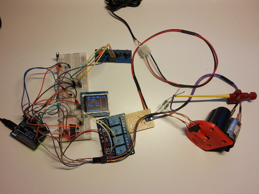
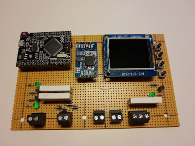
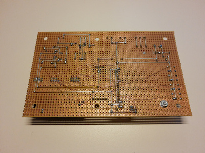

# FunkyChickenDoor_HW
In this repository the **electronic hardware** for the 'Funky Chicken Door' [project](https://github.com/HoeckFlori/FunkyChickenDoor_SW) is developed.

The idea is, to develop a automatic chicken house and provide it on a professional level with simple, available and inexpensive components. For detailed information about the features, the usage and anything else, have a look into the [corresponding software repo](https://github.com/HoeckFlori/FunkyChickenDoor_SW).

The circuit diagrams (and PCBs) was drawn with [KiCad](https://kicad.org/) and can be opened and edited at any time with it.

## Version 1 (the development version)
**Status: 'Development in progress'**

The 'development version' can be built by everyone who 'controls the force' of soldering (or has a breadboard). The always latest circuit diagram can be found [here](./AMShieldV1/ChickenDoor_V1.pdf). The KiCad project folder is [./AMShieldV1](./AMShieldV1/). The components used are standard components that many should have at home. Only the parts listed under [the table](#V1_tableWithSpecializedComponents) are special. Hint: Instead of the 'Mega 2560 PRO' you can also use a normal 'Arduino Mega 2560', just costs more. The same applies to the Display - a ten a penny.

After completion of the development work it is planned to offer a clean PCB solution with version 2.

### The flying development structure

### The stripboard solution
 

<a name="V1_tableWithSpecializedComponents">
### The more 'specialized' components you need to get

| What | Link to further information and (possible) vendors | Detailed information | Realistic price (from a well-known auction platform with longer shipping time), mid 2020
|---|---| ---------| ---|
| MCU Board 'Mega 2560 PRO (Embed) CH340G/ATmega2560-16AU' | [https://robotdyn.com/mega-2560-pro-embed-ch340g-atmega2560-16au.html](https://robotdyn.com/mega-2560-pro-embed-ch340g-atmega2560-16au.html) |  <ul><li>[Dimensional drawing](https://robotdyn.com/pub/media/0G-00005641==MEGA-PRO-CH340GATmega2560/DOCS/DIM==0G-00005641==MEGA-PRO-CH340GATmega2560.pdf)</li><li>[Input and Output I/O diagram](https://robotdyn.com/pub/media/0G-00005641==MEGA-PRO-CH340GATmega2560/DOCS/PINOUT==0G-00005641==MEGA-PRO-CH340GATmega2560.pdf)</li><li>[Schematic](https://robotdyn.com/pub/media/0G-00005641==MEGA-PRO-CH340GATmega2560/DOCS/Schematic==0G-00005641==MEGA-PRO-CH340GATmega2560.pdf)</li></ul> | ~ 7,- €
| RTC DS3231 I2C AT24C32 Real Time Clock | https://www.makershop.de/module/rtc/rtc-ds3231-i2c/ | [Interface DS3231 Precision RTC Module with Arduino](https://lastminuteengineers.com/ds3231-rtc-arduino-tutorial/) | ~ 3,- €
| 1,8 Zoll TFT LCD Display Modul 128×160 | [https://www.amazon.com/HiLetgo-ST7735R-128160-Display-Arduino/dp/B00LSG51MM](https://www.amazon.com/HiLetgo-ST7735R-128160-Display-Arduino/dp/B00LSG51MM) | Try to get a display like in the link! The market is full of displays of this type, but each one has other connectors, dimensions, orientations, ... .  Some may interesting links:  [1.8" Serial SPI 128x160 Color TFT LCD Module Display](https://www.openhacks.com/uploadsproductos/tutorial_display_tft.pdf),  [https://learn.adafruit.com/1-8-tft-display/breakout-pinouts](https://learn.adafruit.com/1-8-tft-display/breakout-pinouts),  [Arduino Tutorial: Making the KMR-1.8 SPI (TFT Display) work!](https://www.mschoeffler.de/2019/06/20/arduino-tutorial-making-the-kmr-1-8-spi-tft-display-work/) | ~ 8,-€   (on a well-known internet auction house)

## Version 2
**Status: 'Development not even started yet''**

The 'final version' ...