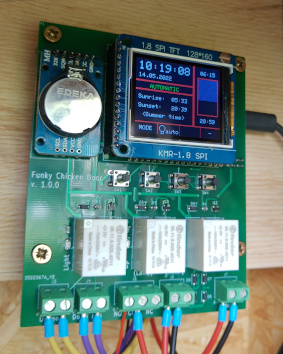

# FunkyChickenDoor_HW

In this repository the **electronic hardware** for the 'Funky Chicken Door' [project](https://github.com/HoeckFlori/FunkyChickenDoor_SW) is/was developed.

The idea is, to develop a automatic chicken-house-door-controller and provide it on a semi-professional level with simple, available and inexpensive components. For detailed information about the features, the usage and anything else, have a look into the [corresponding software repo](https://github.com/HoeckFlori/FunkyChickenDoor_SW).

The circuit diagrams and PCB is drawn with [KiCad](https://kicad.org/) and can be opened and edited at any time with it.

You can build up the hardware as strip board solution or order a PCB from your preferred PCB dealer.  

  
'development stripboard solution'

If you want want to use the hardware you can rebuild it for your private stuff. A BOM with the order codes to an German electronic distributor is attached. Nevertheless some 'specialized' components are needed. Look below.

In case of problems, errors or suggestions for improvement, please send me an issue.

# Quick links within the repository
## KiCad project
[KiCadProject](./AMShieldV1/ChickenDoor_V1.pro)

## Schematic
[Schematic](./AMShieldV1/ChickenDoor_V1_1-0-0_Schematic.pdf)

## Assembly print
[Assembly print](./AMShieldV1/ChickenDoor_V1_1-0-0_AssemblyPrint.pdf)

## BOM (bill of materials)
[Schematic](./AMShieldV1/ChickenDoor_V1_1-0-0_BOM_withReicheltOrderCodes.ods)

## Pictures of the PCB

  
Click me to see some screenshots

  

## The more 'specialized' components you need to get

  
'click me to open the list'

| What                                                     | Link to further information and (possible) vendors                                                                                                                                                                                                                                                                                                                                               | Detailed information                                                                                                                                                                                                                                                                                                                                                                                                                                                                                                                                                                                                            | Realistic price (from a well-known auction platform with longer shipping time), mid 2020 |
| -------------------------------------------------------- | ------------------------------------------------------------------------------------------------------------------------------------------------------------------------------------------------------------------------------------------------------------------------------------------------------------------------------------------------------------------------------------------------ | ------------------------------------------------------------------------------------------------------------------------------------------------------------------------------------------------------------------------------------------------------------------------------------------------------------------------------------------------------------------------------------------------------------------------------------------------------------------------------------------------------------------------------------------------------------------------------------------------------------------------------- | ---------------------------------------------------------------------------------------- |
| MCU Board 'Mega 2560 PRO (Embed) CH340G/ATmega2560-16AU' | [https://robotdyn.com/mega-2560-pro-embed-ch340g-atmega2560-16au.html](https://robotdyn.com/mega-2560-pro-embed-ch340g-atmega2560-16au.html) or [https://www.reichelt.de/at/en/arduino-compatible-mega-2560-pro-board-ard-mega2560-pro-p299355.html?&trstct=pos_0&nbc=1](https://www.reichelt.de/at/en/arduino-compatible-mega-2560-pro-board-ard-mega2560-pro-p299355.html?&trstct=pos_0&nbc=1) | <ul><li>[Dimensional drawing](https://robotdyn.com/pub/media/0G-00005641==MEGA-PRO-CH340GATmega2560/DOCS/DIM==0G-00005641==MEGA-PRO-CH340GATmega2560.pdf)</li><li>[Input and Output I/O diagram](https://robotdyn.com/pub/media/0G-00005641==MEGA-PRO-CH340GATmega2560/DOCS/PINOUT==0G-00005641==MEGA-PRO-CH340GATmega2560.pdf)</li><li>[Schematic](https://robotdyn.com/pub/media/0G-00005641==MEGA-PRO-CH340GATmega2560/DOCS/Schematic==0G-00005641==MEGA-PRO-CH340GATmega2560.pdf)</li></ul>                                                                                                                                 | ~ 7,- €                                                                                  |
| RTC DS3231 I2C AT24C32 Real Time Clock                   | https://www.makershop.de/module/rtc/rtc-ds3231-i2c/                                                                                                                                                                                                                                                                                                                                              | [Interface DS3231 Precision RTC Module with Arduino](https://lastminuteengineers.com/ds3231-rtc-arduino-tutorial/)                                                                                                                                                                                                                                                                                                                                                                                                                                                                                                              | ~ 3,- €                                                                                  |
| 1,8 Zoll TFT LCD Display Modul 128×160                   | [https://www.amazon.com/HiLetgo-ST7735R-128160-Display-Arduino/dp/B00LSG51MM](https://www.amazon.com/HiLetgo-ST7735R-128160-Display-Arduino/dp/B00LSG51MM) or [https://www.makershop.de/display/lcd-tft/waveshare-1-8inch-lcd-modul/](https://www.makershop.de/display/lcd-tft/waveshare-1-8inch-lcd-modul/)                                                                                     | Try to get a display like in the link! The market is full of displays of this type, but each one has other connectors, dimensions, orientations, ... .  Some may interesting links:  [1.8" Serial SPI 128x160 Color TFT LCD Module Display](https://www.openhacks.com/uploadsproductos/tutorial_display_tft.pdf),  [https://learn.adafruit.com/1-8-tft-display/breakout-pinouts](https://learn.adafruit.com/1-8-tft-display/breakout-pinouts),  [Arduino Tutorial: Making the KMR-1.8 SPI (TFT Display) work!](https://www.mschoeffler.de/2019/06/20/arduino-tutorial-making-the-kmr-1-8-spi-tft-display-work/) | ~ 8,-€   (on a well-known internet auction house)                                    |

# FAQ
Currently nothing :smiley: